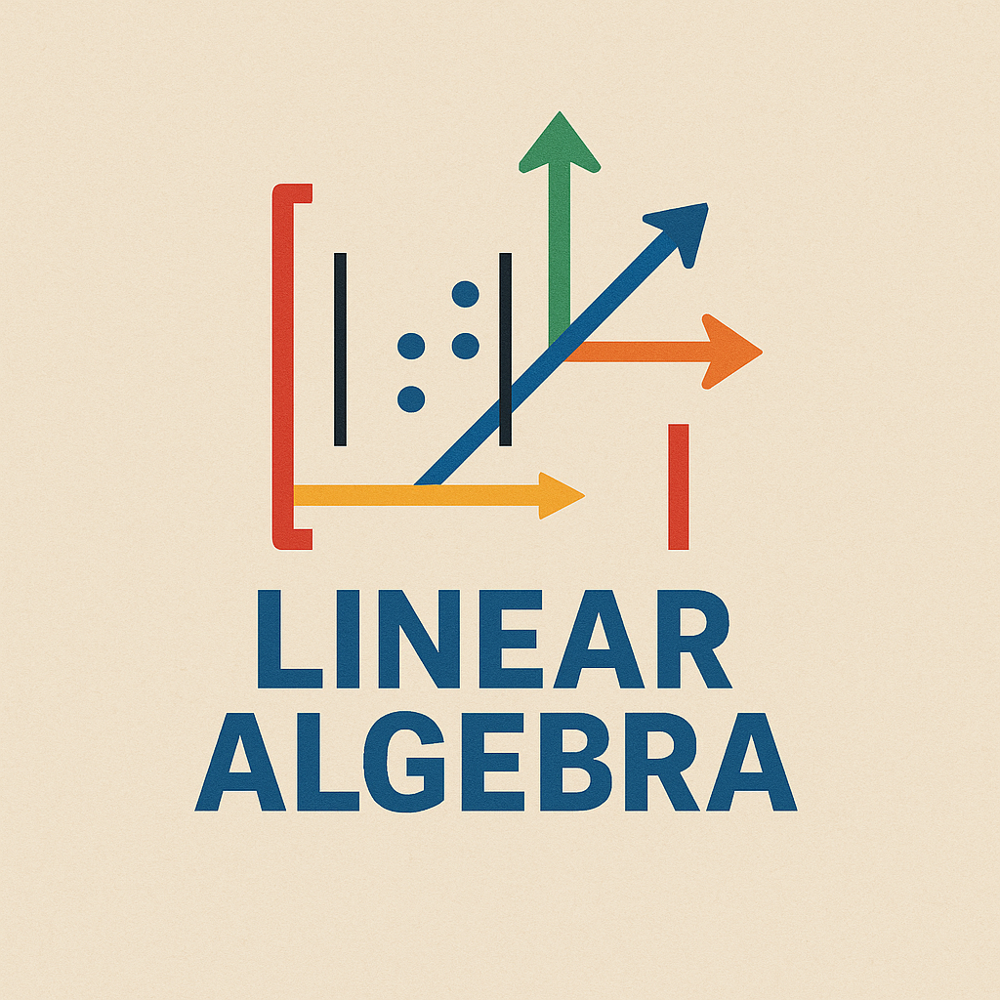

This course is a concise but applied introduction to the linear algebra used in computer vision, graphics, robotics, signal processing, machine learning, and engineering.

It is intended for undergraduate Electronic Engineering students, MSc Artificial Intelligence students, and professionals who want a practical mathematical refresher.

The course follows a repeated pattern:

> Motivation -> Theory -> Geometry -> Worked Example -> Implementation -> Application -> Practice

## Prerequisite

- Comfort with algebra and basic function notation.
- Some exposure to vectors or matrices is helpful, but the first modules review the essentials.
- No programming experience is required, although Python and NumPy examples are included.

## Learning Outcomes

By the end of the course, students will be able to:

- **Core Algebraic Skills**
  - Perform vector and matrix operations; compute dot products, projections, and norms.
  - Execute Gaussian elimination; identify REF/RREF; compute inverses when they exist.
  - Calculate determinants and explain their geometric meaning.
  - Solve systems of equations using elimination, matrix methods, and least squares.
- **Conceptual and Geometric Understanding**
  - Interpret linear combinations, span, basis, dimension, and vector spaces.
  - Understand the four fundamental subspaces.
  - Visualize orthogonality, projections, and least squares solutions.
- **Advanced Topics**
  - Compute eigenvalues/eigenvectors; diagonalize matrices when possible.
  - Work with symmetric matrices, quadratic forms, and positive definiteness.
  - Understand and apply the Singular Value Decomposition and Principal Component Analysis.
- **Software Skills**
  - Use Python/NumPy for computations.
  - Apply code to solve systems, perform least squares, compute eigenvalues, and run PCA.

## Current Modules


<section>
  <h2>Module {{ module.number }}: {{ module.title }}</h2>
  
{{ module.summary }}

  <ul>
  
    <li><a href="{{ lesson.url | relative_url }}">{{ lesson.title }}</a></li>
  
  </ul>
</section>


## Main References

- Gilbert Strang, *Introduction to Linear Algebra*, 5th Edition.
- Janis Lazovskis, *Introduction to Linear Algebra*.
